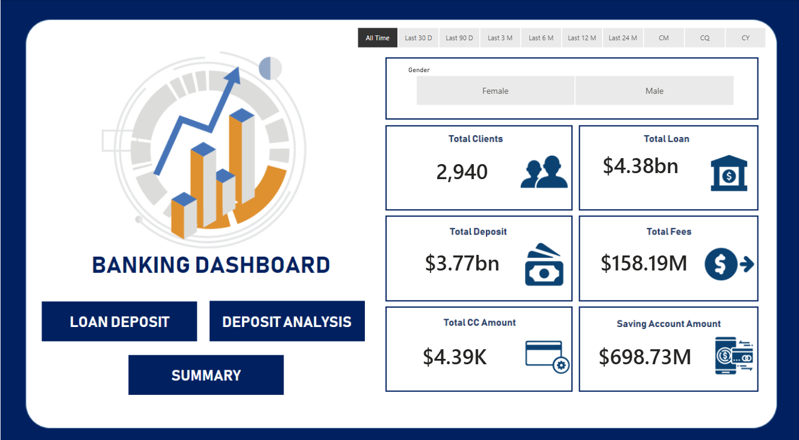
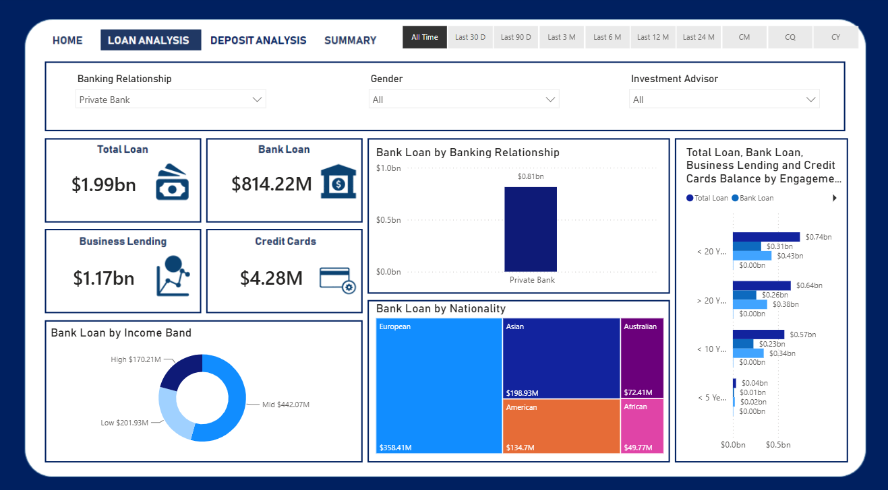
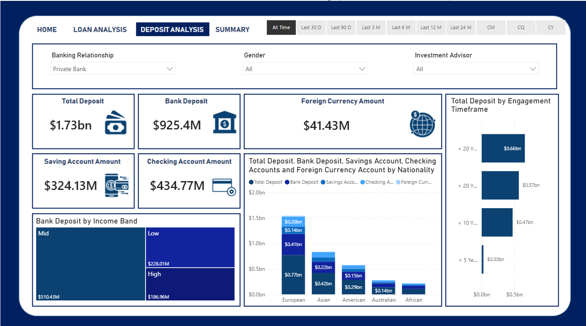
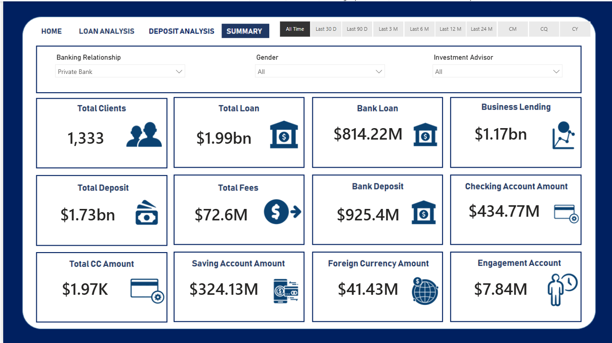

# 🏦 Banking Customer & Financial Analytics

## 📊 Project Overview

An interactive banking analytics dashboard built using Microsoft Power BI and Excel to analyze customer profiles, loans, deposits, savings, credit card balances, income, loyalty, and financial performance.

The dashboard provides an interactive view of banking customers and financial metrics across multiple analytical areas, including loan analysis, deposit analysis, customer summary, and customer-level drill-through analysis.

---

## 🎯 Business Objective

The dashboard provides insights into:

- Customer demographics and financial profiles
- Banking relationships
- Loan distribution and lending activity
- Deposit and savings performance
- Credit card balances
- Customer income segments
- Customer loyalty classifications
- Customer financial behavior
- Individual customer financial profiles

---

## 🛠️ Tools & Technologies

- Microsoft Power BI
- DAX
- Power Query
- Microsoft Excel
- Data Visualization
- Business Intelligence

---

## 🔄 Project Workflow

```text
Excel Dataset
      ↓
Data Preparation
      ↓
Power BI Data Model
      ↓
DAX Measures & Calculations
      ↓
Interactive Visualizations
      ↓
Banking Analytics Dashboard

---

## ✨ Dashboard Features

- Interactive KPI cards
- Customer demographic analysis
- Loan and lending analysis
- Deposit and savings analysis
- Income-based customer analysis
- Loyalty classification
- Interactive filters and slicers
- Multi-page Power BI navigation
- Customer-level drill-through analysis
- Financial product analysis

---

# 📈 Dashboard Pages

## 1. Home

The Home page provides a high-level overview of the banking portfolio.

### Key Metrics

- Total Customers
- Total Loans
- Total Deposits
- Total Fees
- Credit Card Balance
- Savings Balance

### Filters

- Time Period
- Gender
- Banking Relationship
- Investment Advisor



---

## 2. Loan Analysis

The Loan Analysis page focuses on lending activity and customer loan behavior.

### Analysis Includes

- Bank Loan by Banking Relationship
- Bank Loan by Nationality
- Bank Loan by Income Band
- Total Loan
- Bank Loan
- Business Lending
- Credit Card Balance



---

## 3. Deposit Analysis

The Deposit Analysis page focuses on customer deposits and savings products.

### Analysis Includes

- Total Deposits
- Savings Accounts
- Checking Accounts
- Foreign Currency Accounts
- Deposit Distribution
- Customer Financial Segments



---

## 4. Customer Summary

The Customer Summary page provides insights into customer characteristics and financial relationships.

### Analysis Includes

- Customer Demographics
- Income
- Loyalty Classification
- Banking Relationship
- Financial Product Usage
- Customer-Level Financial Metrics



---

## 5. Customer Drill-Through

The Drill-Through page provides a detailed view of an individual customer.

### Customer-Level Information

- Income
- Loans
- Deposits
- Savings
- Credit Card Balance
- Financial Products
- Customer Classification
- Other Available Banking Metrics


---

# 📊 Key KPIs

| KPI | Description |
|---|---|
| Total Customers | Number of customers in the dataset |
| Total Loans | Overall loan exposure |
| Total Deposits | Total customer deposits |
| Total Fees | Banking fees |
| Credit Card Balance | Total credit card balance |
| Savings Balance | Total savings account balance |

---

# 🔍 Key Analytical Areas

## Customer Analysis

Customer information is analyzed across:

- Age
- Gender
- Nationality
- Occupation
- Income
- Loyalty Classification
- Banking Relationship

## Loan Analysis

Loan activity is analyzed across:

- Banking Relationship
- Nationality
- Income Bands
- Customer Segments
- Business Lending
- Credit Card Balances

## Deposit Analysis

Deposit-related analysis covers:

- Bank Deposits
- Savings Accounts
- Checking Accounts
- Foreign Currency Accounts
- Customer Financial Profiles

---

# 📁 Dataset

The project uses a banking customer dataset containing approximately 3,000 customer records.

The dataset contains information related to:

- Customer Demographics
- Banking Relationships
- Income
- Loans
- Deposits
- Savings
- Credit Cards
- Business Lending
- Properties Owned
- Risk Weighting
- Loyalty Classification

---

# 📂 Repository Structure

```text
Banking-Customer-Financial-Analytics/
│
├── data/
│   └── Banking Dashboard data.xlsx
│
├── docs/
│   ├── home.png
│   ├── loan-analysis.png
│   ├── deposit-analysis.png
│   ├── summary.png
│   └── drill-through.png
│
├── powerbi/
│   └── Banking Dashboard.pbix
│
└── README.md
